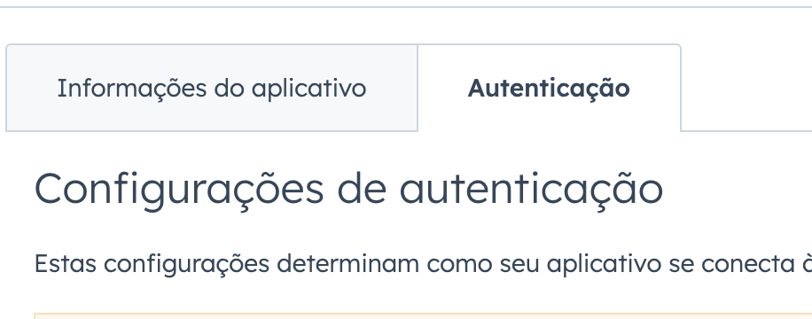
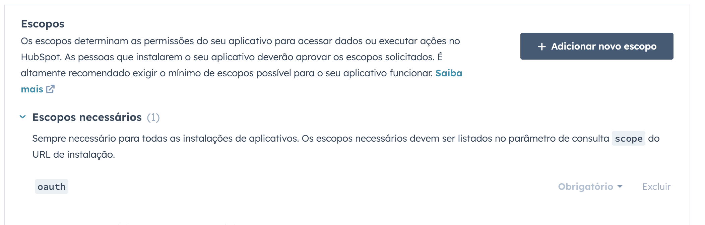

# Teste Tecnico Meetime

## Sumário
- [Introdução](#introducao)
- [Decisões Técnicas](#decisões-técnicas)
- [Setup HubSpot](#setup-hubspot)
- [Setup API](#setup-api)
- [Docs](#docs)
- [Futuras Melhorias](#futuras-melhorias)

## Introdução
Este projeto consiste no desenvolvimento de uma API REST em Java 17/SpringBoot para integrar com a API do HubSpot. A implementação é feita com autenticação via OAuth 2.0 e possibilita a criação de contatos, a api também recebe eventos via webhook toda vez que um novo contato é criado por fim a api processa o evento e salva em uma base de dados h2 em memória.

## Decisões Técnicas

- Java 17 e o Spring framework foram decições baseadas apenas em familiaridade com a tecnologia.
- Banco de dados H2 foi escolhido pela simplicidade de uso e da falta de necessidade de um banco de dados mais complexo visto que API nao tinha relações muito complexas para precisar de um postgres por exemplo.
- NGROK foi escolhido para facilitar a comunicação do webhook com a api.

## Setup HubSpot

- Crie uma conta de desenvolvedor
#
- Entre na área de Aplicativos

#
- Crie um novo aplicativo

#
- Entre na área de Autenticação

#
- Adicione a url abaixo no seguinte campo
`localhost:8080/api/oauth/callback`

#
- Na Área de escopo adicione os seguintes escopos
`crm.objects.contacts.read`
`crm.objects.contacts.write`

#
- Crie o aplicativo

 
# 
- Agora com aplicativo criado abra Testar contas

#
- Crie uma conta de teste de desenvolvedor

Está finalizado o setup no HubSpot e no próximo tópico tera as configurações na API.
## Setup API
#
- Na aba de projetos em Autenticação copie os seguintes valores

`ID do cliente`
`Segredo do cliente`
#
- Agora substitua os valores das variaveis CLIENT_ID e CLIENT_SECRET no application.properties

#
- Apos instalar todas as dependencias do pom podemos startar a API
#
- Apos API startar acesse o endpoint abaixo

`http://localhost:8080/api/oauth/authorize`
#
- Selecione a conta de teste de desenvolvedor criada anteriormente

#
- Conecte ao aplicativo

#
- Apos receber essa resposta da API esta tudo pronto para criar um novo contato

#
- Para criar um novo contato utilize o curl abaixo

`curl --location 'http://localhost:8080/api/hubspot/new-contact' \
--header 'Content-Type: application/json' \
--header 'Cookie: JSESSIONID=B41802F7100C06ABE854AA45FE006413' \
--data-raw '{
           "email": "teste@exemplo.com",
           "firstName": "João",
           "lastName": "Silva",
           "phone": "+5511999999999"
         }'`
#
- Agora com usuario criado precisamos configurar o webhook, para isso vamos rodar o comando abaixo para criar uma url externa com ngrok

`ngrok http 8080`

#
- No dashboard do HubSpot entre no seu aplicativo e abra a aba webhooks

#
- Agore cole na URL de destino a url que o ngrok gerou + /api/hubspot/webhook

#
- Crie uma assinatura para escutar eventos de criacao de contatos

#
- Apos criar assinatura selecione Exibir assinaturas e Ative a assinatura

- Agora a API esta escutando os eventos e salvando no banco de dados

#
- Está finzalidado, estamos fazendo o fluxo de autenticação e criação de um novo contato e recebendo eventos do webhook assinado para enviar o evento toda vez que for criado um novo contato.

## Futuras Melhorias
- Implementar testes unitários
- Mudar para um banco que não seja em memória
- Melhorar os logs da aplicação
- Adicionar mais recursos além da criação de contatos